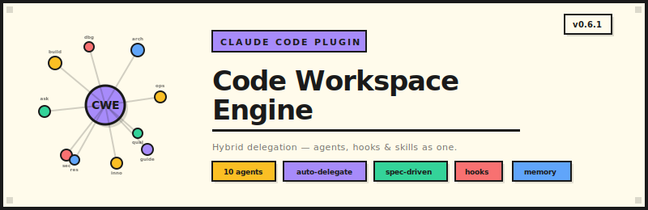

<div align="center">
  

  <br><br>

  <a href="#quick-start"></a>
  
  
  
  

  <br><br>

  <strong>Say what you need. CWE picks the right agent, loads the right standards, and gets it done.</strong>

</div>

<br>

## Quick Start

```bash
# 1. Clone the plugin
git clone https://github.com/LL4nc33/code-workspace-engine.git

# 2. Set up the alias (add to ~/.bashrc or ~/.zshrc)
# --dangerously-skip-permissions lets CWE agents run tools without manual approval each time.
# Only use this in trusted environments — it bypasses Claude Code's per-tool confirmation prompts.
alias cwe='claude --plugin-dir /path/to/code-workspace-engine --dangerously-skip-permissions'

# 3. Start CWE in any project
cd your-project && cwe
/cwe:init    # Initialize project + install plugins + configure statusline
```

After init, just talk naturally:

```
"Fix the login bug"           → builder agent + systematic-debugging
"Build a user profile page"   → builder agent + frontend-design
"Explain how auth works"      → explainer agent + serena
"What if we used GraphQL?"    → innovator agent + brainstorming
"Review my changes"           → quality agent + code-reviewer
```

<br>

## What is CWE?

CWE is a **Claude Code plugin** that turns a single AI assistant into a team of 10 specialized agents. Instead of one generic prompt handling everything, CWE automatically routes your requests to the right expert with the right context.

**Why not just use Claude Code directly?**

|          Without CWE        |                   With CWE                      |
|-----------------------------|-------------------------------------------------|
| One prompt does everything  | 10 specialized agents with focused expertise    |
| You manage context manually | Standards auto-loaded per file type             |
| Memory resets each session  | Daily logs + Serena memory across sessions      |
| No workflow structure       | Plan → Spec → Tasks → Build → Review            |
| Ad-hoc quality              | Quality gates block releases if thresholds fail |
| Secrets might slip through  | Pre-commit safety gate scans every commit       |

<br>

## 6 Core Principles

| # |        Principle        |                       What it means                               |
|---|-------------------------|-------------------------------------------------------------------|
| 1 | **Agent-First**         | All work delegated to specialized agents — never the main context |
| 2 | **Auto-Delegation**     | Describe what you need in natural language, CWE picks the agent   |
| 3 | **Spec-Driven**         | Features flow: Plan → Spec → Tasks → Build → Review               |
| 4 | **Context Isolation**   | Agent work returns compact summaries, not full context            |
| 5 | **Plugin Integration**  | Agents leverage skills from superpowers, serena, feature-dev      |
| 6 | **Always Document**     | Every change updates memory, CHANGELOG, and relevant docs         |

<br>

## 10 Specialized Agents

|      Agent     |          Identity         |                     When to use                        |
|----------------|---------------------------|--------------------------------------------------------|
| **builder**    | The "Code Coroner"        | Write code, fix bugs, implement features, refactor     |
| **architect**  | The System Thinker        | Design systems, write ADRs, shape feature specs        |
| **ask**        | The Discussion Partner    | Open questions, brainstorm approaches, think aloud     |
| **explainer**  | The Patient Educator      | Understand code, concepts, architectural decisions     |
| **quality**    | The Quality Guardian      | Run tests, check coverage, project health dashboard    |
| **security**   | The Cautious Auditor      | OWASP audits, secret scanning, GDPR compliance         |
| **devops**     | The Infrastructure Expert | Docker, CI/CD, releases, deployment                    |
| **researcher** | The Thorough Analyst      | Documentation, codebase analysis, tech research        |
| **innovator**  | The Idea Forge            | Brainstorming, idea backlog, "what if" exploration     |
| **guide**      | The Process Whisperer     | Discover patterns, extract standards, improve workflow |

<br>

<details>
<summary><strong>Commands</strong></summary>

### Workflow

|      Command       |                            Purpose                             |
|--------------------|----------------------------------------------------------------|
| `/cwe:init`        | Initialize project + install recommended plugins + MCP servers |
| `/cwe:plugins`     | Check and install plugin + MCP + skill dependencies            |
| `/cwe:start`       | Guided workflow with phase detection                           |
| `/cwe:help`        | Full documentation                                             |
| `/cwe:screenshot`  | Clipboard screenshot capture + analysis (WSL2, macOS, Linux)   |
| `/cwe:web-research` | Web search + scraping (SearXNG, Firecrawl, trafilatura)       |

### Agent Commands

|      Command      |                       Purpose                       |
|-------------------|-----------------------------------------------------|
| `/cwe:ask`        | Questions, discussions (READ-ONLY)                  |
| `/cwe:builder`    | Implementation, fixes, refactoring                  |
| `/cwe:architect`  | Design, ADRs, spec shaping (Shape-Spec Interview)   |
| `/cwe:devops`     | CI/CD, Docker, releases                             |
| `/cwe:security`   | Security audits, OWASP, GDPR                        |
| `/cwe:researcher` | Documentation, analysis, reports                    |
| `/cwe:explainer`  | Code explanations, concept walkthroughs             |
| `/cwe:quality`    | Tests, coverage, health dashboard                   |
| `/cwe:innovator`  | Brainstorming, idea backlog (4 modes)               |
| `/cwe:guide`      | Process improvement, standards discovery + indexing |

</details>

<details>
<summary><strong>How Auto-Delegation Works</strong></summary>

```
User request
    ↓
Explicit /command? → Execute command directly
    ↓ no
Plugin skill matches? → Invoke skill (priority over agents)
    ↓ no
CWE agent matches? → Delegate to agent
    ↓ no
Multi-step task? → Delegate to subagents (via delegator skill)
    ↓ no
Unclear? → Ask (max 2 questions)
```

### Intent → Agent Mapping

|                                 Keywords                                     |     Agent      |
|------------------------------------------------------------------------------|----------------|
| implement, build, create, fix, code, feature, bug, refactor                  | **builder**    |
| question, discuss, think about                                               | **ask**        |
| explain, how, what, why, understand                                          | **explainer**  |
| test, write tests, coverage, quality, validate, assert, metrics, flaky, gate | **quality**    |
| security, audit, vulnerability, scan, gdpr, owasp, cve                       | **security**   |
| deploy, docker, ci, cd, release, kubernetes, k8s, terraform                  | **devops**     |
| design, architecture, adr, api, schema                                       | **architect**  |
| analyze, document, research, compare                                         | **researcher** |
| brainstorm, idea, ideas, what if, alternative, explore                       | **innovator**  |
| workflow, process, pattern, improve, optimize, optimization                  | **guide**      |

Say **"manual"** to disable auto-delegation.

</details>

<details>
<summary><strong>Workflow Phases</strong></summary>

```
  ┌─────────────────────────────────────────────────────┐
  │                                                     │
  │   Plan ──→ Spec ──→ Tasks ──→ Build ──→ Review      │
  │    │         │                   │         │        │
  │    │    Shape-Spec          Wave Exec   Quality     │
  │    │    Interview           (parallel)   Gates      │
  │    │                                      │         │
  │    └──────────────────────────────────────┘         │
  │                  next feature                       │
  └─────────────────────────────────────────────────────┘
```

1. **Plan** — Define product vision in `workflow/product/mission.md`
2. **Spec** — Shape-Spec Interview creates spec folder with plan, scope, references, standards
3. **Tasks** — Break spec into implementable tasks with dependencies
4. **Build** — Wave execution: up to 3 agents work in parallel per wave
5. **Review** — Quality gates verify coverage, complexity, security before release

</details>

<details>
<summary><strong>Memory System</strong></summary>

CWE remembers across sessions through a layered memory system:

|    Layer   |            File             |                              Purpose                              |
|------------|-----------------------------|-------------------------------------------------------------------|
| Index      | `memory/MEMORY.md`          | Curated hub (max 200 lines), auto-injected at every session start |
| Daily Logs | `memory/YYYY-MM-DD.md`      | Append-only session logs, today + yesterday injected              |
| Decisions  | `memory/decisions.md`       | Architecture Decision Records                                     |
| Patterns   | `memory/patterns.md`        | Recognized work patterns                                          |
| Context    | `memory/project-context.md` | Tech stack, priorities (auto-seeded at init)                      |
| Ideas      | `memory/ideas.md`           | Curated idea backlog                                              |

**Session lifecycle:**
- **Start** → MEMORY.md + today's log + yesterday's log injected as context
- **Working** → Agents read/write memory files as needed
- **Pre-Compact** → Memory saved before context compression
- **Stop** → Daily log entry written, old logs (>30 days) cleaned up


</details>

<details>
<summary><strong>Safety &amp; Standards</strong></summary>

### Pre-Commit Safety Gate

Automatically scans every `git commit`, `git push`, and `git add -A`:

- API keys & secrets (OpenAI, Anthropic, AWS, GitHub, Slack)
- Private keys & certificates (.pem, .key, .pfx)
- Hardcoded passwords & database credentials
- Environment files (.env)
- .gitignore completeness validation

Blocked commits show the exact file and line with remediation guidance.

### Git Standards

Enforced via PreToolUse hooks:
- **Conventional Commits** — `type(scope): subject` (feat, fix, chore, docs, refactor, test, perf, ci, build, revert)
- **Branch Naming** — `feature/`, `fix/`, `hotfix/`, `chore/`, `release/`
- **Auto Release Notes** — Generated from conventional commits via `/cwe:devops release`

### Code Standards

8 domain-specific rule files in `.claude/rules/`, auto-loaded by file path:
- `global-standards.md` — Always active
- `api-standards.md` — REST endpoints, validation
- `frontend-standards.md` — Components, state management
- `database-standards.md` — Migrations, queries
- `devops-standards.md` — Docker, CI/CD
- `testing-standards.md` — Coverage, assertions
- `agent-standards.md` — Agent/skill authoring
- `documentation-standards.md` — Memory updates, docs

Discover new standards: `/cwe:guide discover`

</details>

<details>
<summary><strong>Statusline — Live Session Tracking (Claude Code feature, configured by CWE)</strong></summary>

<br>

<div align="center">

```
┌─────────────────────────────────────────────────────────────────────────────────┐
│                                                                                 │
│  ● Claude Code                                                      ─  □  ✕    │
│  ─────────────────────────────────────────────────────────────────────────────  │
│                                                                                 │
│  ❯ Fix the authentication bug in the login flow                                 │
│                                                                                 │
│  ● Using builder agent with systematic-debugging skill                          │
│                                                                                 │
│    I found the issue — the JWT token validation was missing the                 │
│    audience check. Here's the fix:                                              │
│                                                                                 │
│  ● Edited src/auth/jwt.ts (+3/-1)                                               │
│  ● Ran 12 tests — all passing                                                   │
│                                                                                 │
│  ❯ █                                                                            │
│                                                                                 │
│  ─────────────────────────────────────────────────────────────────────────────  │
│  my-saas-app  │  context ━━━━━━━──── 42% 84k/200k  │  EUR 1.85  │  time 8m32s   │
│  ⏵⏵ bypass permissions on (shift+tab to cycle)                                │
└─────────────────────────────────────────────────────────────────────────────────┘
```

</div>

Track your session in real time — always visible at the bottom of Claude Code:

- **Project name** — always know which project you're in
- **Context bar** — color-coded progress (green → yellow → red) with token count
- **Cost** — track how much each project costs per session
- **Time** — see how long you've been working
- **Lines** — code changes at a glance

Currency is configurable during `/cwe:init` (EUR, USD, GBP, CHF) and stored in `.claude/cwe-settings.yml`.

</details>

<details>
<summary><strong>Skills — Proactive Workflows</strong></summary>

CWE includes 9 skills that activate automatically based on context:

|        Skill       |                   When it activates                         |
|--------------------|-------------------------------------------------------------|
| `auto-delegation`  | On every user request — routes to the right agent           |
| `agent-detection`  | During Build phase — assigns agents to tasks                |
| `git-standards`    | On git commit/branch — enforces Conventional Commits        |
| `safety-gate`      | Before git commit/push — scans for secrets                  |
| `quality-gates`    | After implementation — verifies coverage & complexity       |
| `health-dashboard` | On `/cwe:quality health` — project health overview          |
| `project-docs`     | When docs need updating — README, architecture              |
| `web-research`     | Local web search (SearXNG + Firecrawl, URLs via `cwe-settings.yml`) |
| `delegator`        | Multi-step requests — decomposes + dispatches to multiple agents    |

</details>

<br>

## Plugin Dependencies

`/cwe:init` checks and offers to install:

|                         Plugin                           |    Level    |                     Purpose                      |
|----------------------------------------------------------|-------------|--------------------------------------------------|
| [superpowers](https://github.com/anthropics/superpowers) | Required    | TDD, systematic debugging, planning, code review |
| [serena](https://github.com/codegen-sh/serena)           | Recommended | Semantic code analysis, symbol navigation        |
| [feature-dev](https://github.com/anthropics/feature-dev) | Recommended | 7-phase feature development workflow             |

### MCP Servers

|   Server   |                  Purpose                 |
|------------|------------------------------------------|
| playwright | Browser testing, screenshot verification |
| context7   | Library documentation lookup             |
| github     | GitHub API integration                   |

<br>

## Project Structure

After `/cwe:init`, your project gets (`memory/` and `workflow/` are auto-added to `.gitignore`):

```
your-project/
├── VERSION                     # Single source of truth (semver)
├── workflow/
│   ├── config.yml              # CWE configuration
│   ├── ideas.md                # Curated idea backlog
│   ├── product/
│   │   └── mission.md          # Product vision
│   ├── specs/                  # Feature specifications (created per feature)
│   └── standards/              # Project-specific standards
├── .claude/
│   └── cwe-settings.yml        # Project settings (currency, etc.)
├── memory/                     # Optional — skipped if using Serena memory
│   ├── MEMORY.md               # Index (200-line max, always injected)
│   ├── YYYY-MM-DD.md           # Daily logs (auto-created)
│   ├── ideas.md                # Idea backlog summary
│   ├── decisions.md            # Architecture Decision Records
│   ├── patterns.md             # Recognized patterns
│   └── project-context.md      # Tech stack (auto-seeded)
└── docs/
    ├── README.md               # Project README
    ├── ARCHITECTURE.md         # System architecture
    ├── API.md                  # API documentation
    ├── SETUP.md                # Setup guide
    ├── DEVLOG.md               # Developer journal
    └── decisions/              # ADR folder
```

<br>

## Version History

See [CHANGELOG.md](CHANGELOG.md) for full history. See [ROADMAP.md](ROADMAP.md) for planned features.

|   Version  |                                  Highlights                                |
|------------|----------------------------------------------------------------------------|
| **0.6.0**  | Hybrid delegation: intent-router hook, minimal CLAUDE.md, sharp descriptions | (current)
| **0.5.1**  | Hook hardening (_lib.sh), ARCHITECTURE.md, statusline template, doc fixes  |
| **0.5.0**  | Statusline with live cost/context tracking, currency config, hook fixes    |
| **0.4.4**  | Removed cwe-memory MCP, added screenshot + web-research, consistency fixes |
| **0.4.3**  | Documentation: USER-GUIDE, README rewrite, SVG assets                      |
| **0.4.2**  | Memory System v2: daily logs, context injection, auto-seeding              |
| **0.4.1**  | Native alignment: 10 agents, standards system, idea capture, safety gate   |
| **0.4.0a** | Plugin integration, skill cleanup, roadmap                                 |
| **0.3.1**  | Simplified commands, superpowers integration                               |

<br>

<div align="center">

## Documentation

[User Guide](docs/USER-GUIDE.md) | [Architecture](docs/ARCHITECTURE.md) | [Changelog](CHANGELOG.md) | [Roadmap](ROADMAP.md)

<br>

**License:** MIT | **Author:** [LL4nc33](https://github.com/LL4nc33)

</div>
