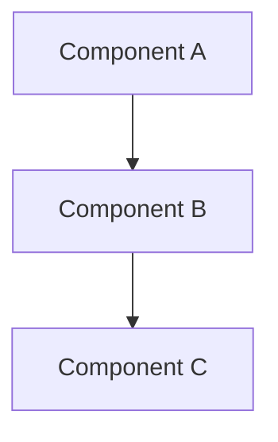
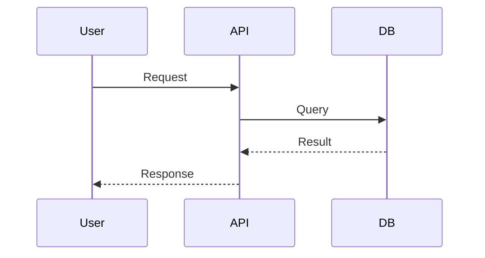

# Architecture: {{PROJECT_NAME}}

## Overview

[High-level system description]

## Component Diagram

## Components

### Component A

- **Purpose:** [what it does]
- **Location:** `src/component-a/`
- **Dependencies:** [what it depends on]

### Component B

- **Purpose:** [what it does]
- **Location:** `src/component-b/`
- **Dependencies:** [what it depends on]

## Data Flow

## Key Decisions

See [decisions/](decisions/) for Architecture Decision Records.

## Tech Stack

| Layer | Technology | Rationale |
|-------|-----------|-----------|
| [Layer] | [Tech] | [Why] |
